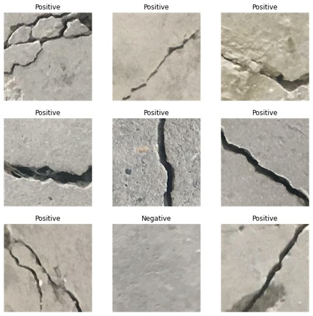
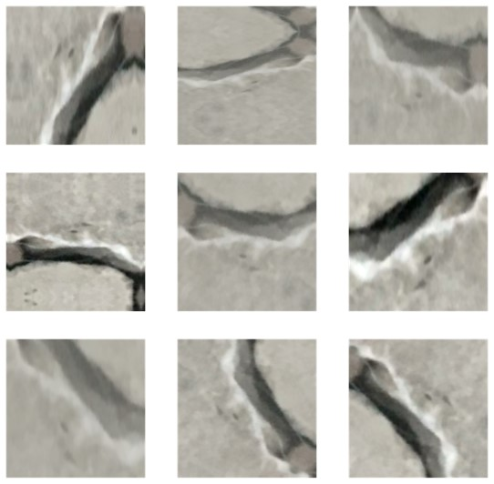
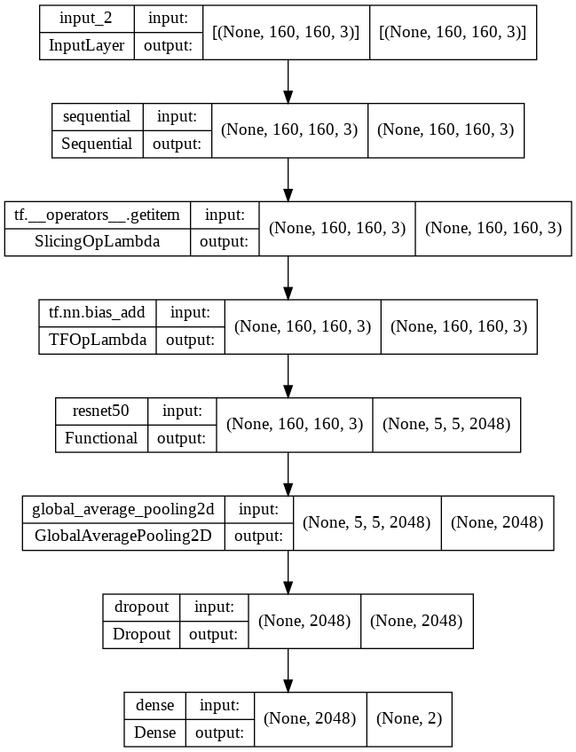
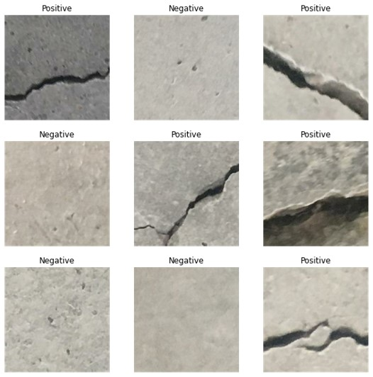

# Concrete Crack Classification

Performs transfer learning to classify images of concrete as having crack or not, using <a href="https://www.tensorflow.org/api_docs/python/tf/keras/applications/resnet50">ResNet50</a> as base model. Dataset is obtained from <a href="https://data.mendeley.com/datasets/5y9wdsg2zt/2">Mendeley Data</a>.

## Methodology
### Data Preprocessing
- Dataset is split into train, validation and test sets with ratio of 70:24:6.
- Data augmentation layer is applied to further diversify the dataset.
- Applied augmentation layers are `RandomFlip`, `RandomRotation`, `RandomContrast` and `RandomZoom`.
- Augmented data is then preprocessed by `tensorflow.keras.applications.resnet50.preprocess_input` layer.

#### Example of original data

#### Example of augmented data

### Model Architecture
- 3 additional layers (GlobalAveragePooling2D, Dropout, Dense) were appended after the base model layer:
  - `GlobalAveragePooling2D` layer to aggregate width and height into 1 dimension. Transforming the last layer of the base model from shape of `(32, 5, 5, 2048)` to `(32, 2048)`.
  - `Dropout` layer with rate of 0.2 to reduce chances of overfitting.
  - Final `Dense` layer with 2 nodes as output layer.
- Base model layer was first freezed to train the above appended layers.
- Early stopping callback is applied during this initial training. Training stopped at epoch 2 with `val_accuracy: 0.9982`.
- Next, 1 out of 175 layers of base model were unfreezed for fine tuning.
- Again, early stopping was also applied to fine tuning. Training stopped at epoch 2 with no improvement in validation accuracy.

#### Model architecture summary

#### Prediction on test data

## Credits
2018 – Özgenel, Ç.F., Gönenç Sorguç, A. “Performance Comparison of Pretrained Convolutional Neural Networks on Crack Detection in Buildings”, ISARC 2018, Berlin.

Lei Zhang , Fan Yang , Yimin Daniel Zhang, and Y. J. Z., Zhang, L., Yang, F., Zhang, Y. D., & Zhu, Y. J. (2016). Road Crack Detection Using Deep Convolutional Neural Network. In 2016 IEEE International Conference on Image Processing (ICIP). http://doi.org/10.1109/ICIP.2016.7533052
